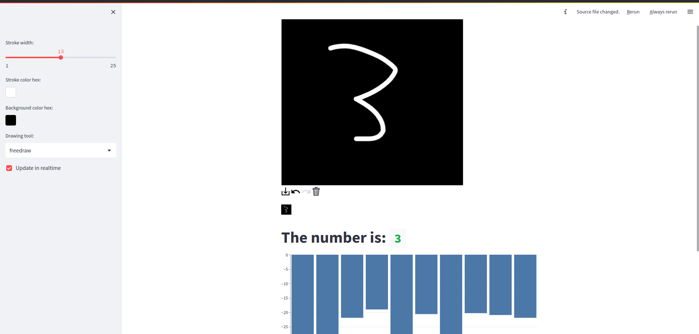

# streamlit_MNIST

This is a simple web app that uses a convolutional neural network to classify handwritten digits. The model is trained on the MNIST dataset.

## Usage

To run the app, run the following command in your terminal:

```bash
streamlit run server.py
```

## Preview

